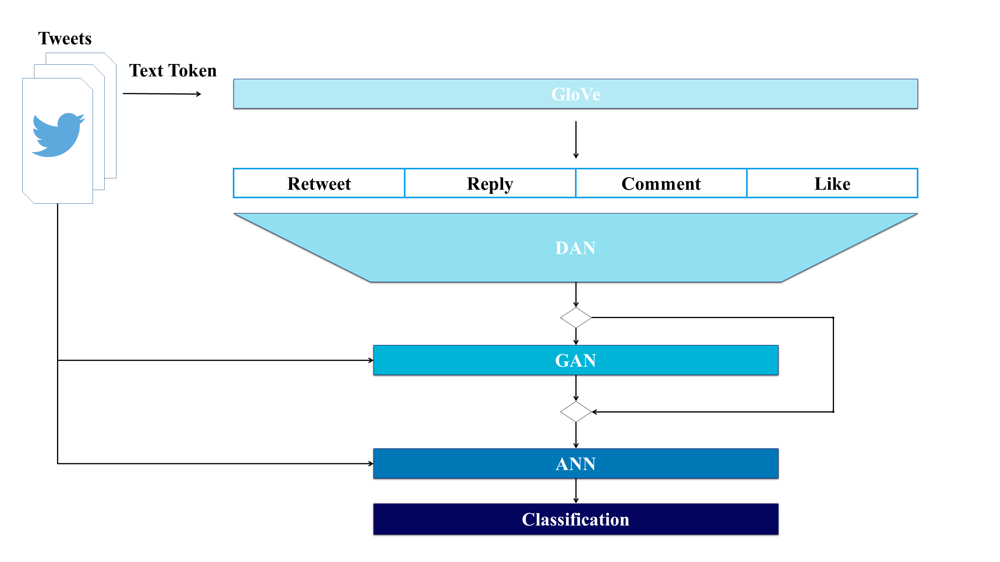

# Twitter RecSys Challenge 2021

## 1. :family_man_boy_boy: Members

  - YoungIn Kwon(권영인) - Master degree student in AIGS(Aritificial Intelligence Graduate School) of UNIST(Ulsan National Institute of Science and Technology; South Korea)
  - JoonHyung Kim(김준형) - Master degree student in AIGS(Aritificial Intelligence Graduate School) of UNIST(Ulsan National Institute of Science and Technology; South Korea) 
  - YeongHo Lee(이영호) - Undergraduate student in Industrial Engineering of UNIST(Ulsan National Institute of Science and Technology; South Korea)

## 2. :world_map: Competition Overview

- **Goal**: 
  - To predict the probability of different engagement types of a target user for a set of tweets based on heterogeneous input data **while providing fair recommendations**.
- **schedule**
  
    | index | date                 | content                                                                                          |
    |-------|----------------------|--------------------------------------------------------------------------------------------------|
    | 1     | 19 March, 2021       | Open to registration                                                                             |
    | 2     | 22 March, 2021       | Dataset release & RecSys challenge starts                                                        |
    | 3     | 30 March, 2021       | Validation server open                                                                           |
    | 4     | June 9, 2021         | Validation data released, test server opens                                                      |
    | 5     | June 23, 2021        | RecSys challenge ends                                                                            |
    | 6     | June 30, 2021        | Announcement of the final leaderboard and winners Paper submission for RecSys Challenge Workshop |
    | 7     | July 13, 2021        | Paper submissions due                                                                            |
    | 8     | Aug 10, 2021         | Paper acceptance notifications                                                                   |
    | 9     | Aug 23, 2021         | Camera-ready papers due                                                                          |
    | 10    | Sep 27 - Oct 1, 2021 | Workshop taking place as part of the ACM RecSys conference.                                      |

- **Data** 
  - Tweet Features
    - Text tokens: Ordered list of Bert ids corresponding to Bert tokenization of Tweet text
    - Hashtags:Tab separated list of hastags (identifiers) present in the tweet
    - Tweetd id:Tweet identifier
    - Present media:Tab separated list of media types. Media type can be in (Photo, Video, Gif)
    - Present links:Tab separeted list of links (identifiers) included in the Tweet
    - Present domains:Tab separated list of domains included in the Tweet (twitter.com, dogs.com)
    - Tweet type:Tweet type, can be either Retweet, Quote or Toplevel
    - Language:Identifier corresponding to the inferred language of the Tweet
    - Timestamp:Unix timestamp, in sec of the creation time of the Tweet
  - Engaged With User Features
    - User id:User identifier
    - Follower count:Number of followers of the user
    - Following count:Number of accounts the user is following
    - Is verified?:Is the account verified?
    - Account creation time:Unix timestamp, in seconds, of the creation time of the account
  - Engaging User Features
    - User id:User identifier
    - Follower count:Number of followers of the user
    - Following count:Number of accounts the user is following
    - Is verified?:Is the account verified?
    - Account creation time:Unix timestamp, in seconds, of the creation time of the account
  - Engagement Features
    - Engagee follows engager?:Does the account of the engaged tweet author follow the account that has made the engagement?
    - Reply engagement timestamp:If there is at least one, unix timestamp, in s, of one of the replies
    - Retweet engagement timestamp:If there is one, unix timestamp, in s, of the retweet of the tweet by the engaging user
    - Retweet with comment engagement timestamp:If there is at least one, unix timestamp, in s, of one of the retweet with comment of the tweet by the engaging user
    - Like engagement timestamp:If there is one, Unix timestamp, in s, of the like

## 3. :fire: Models
**< Model Structure >**

**<STEP 1>** Pretrain - Text Token Embedding

- Glove
  - Input: text_tokens
  - Ouput: Embedding vector of words
- DAN
  - Input: Embedding vector of GloVe from text_tokens
  - Ouput: d dimension vector
    
**<STEP 2>** OverSampling

- GAN
  - Input: Output of DAN
  - Ouput: Fake inputs with Label
    
**<STEP 3>** Train

- ANN
  - Input: Output of DAN or GAN
  - Ouput: Classifier

**<STEP 4>**  Inference(predict)

- Input: Output of DAN or GAN
- Ouput: Classifier

## 4. :bar_chart: Performance

| index | model                     | RCE     | AP     | Selected |
|-------|---------------------------|---------|--------|----------|
| 1     | ANN_reply_dan_not_gan     | 11.5176 | 0.1092 | O        |
| 2     | ANN_retweet_dan_not_gan   | 9.0952  | 0.2455 |          |
| 3     | ANN_retweet_c_dan_not_gan | 3.0766  | 0.0174 | O        |
| 4     | ANN_like_dan_not_gan      | 9.2520  | 0.5930 |          |
| 5     | ANN_reply_dan_gan         | 11.0893 | 0.1109 |          |
| 6     | ANN_retweet_dan_gan       | 9.2546  | 0.2485 | O        |
| 7     | ANN_retweet_c_dan_gan     | 3.1725  | 0.0166 |          |
| 8     | ANN_like_dan_gan          | 9.1365  | 0.5881 | O        |

## 5. :hammer_and_wrench: Requirements

### 1) Docker Environment(Submission)

<a href="https://hub.docker.com/repository/docker/kwonyoung234/dgann_submission_env">kwonyoung234/dgann_submission_env</a>

### 2) Train Environment
- OS: Windows 10
- CPU: i5-10600K
- GPU: GTX 1660 SUPER
- RAM: 64GB

### 3) Libraries

| Package             | Version  | Installation |
| ------------------- | -------- | ------------ |
| dask                | 2021.4.0 | conda        |
| glove-python-binary | 0.2.0    | pip          |
| numpy               | 1.20.1   | conda        |
| pandas              | 1.2.2    | conda        |
| pytorch             | 1.7.1    | conda        |
| scikit-learn        | 0.24.1   | conda        |
| scipy               | 1.6.1    | conda        |
| torchvision         | 0.8.2    | conda        |
| tqdm                | 4.58.0   | conda        |
| pickle5             | 0.0.11   | pip        |

## 6. :open_file_folder: File and Folder
~~~
├── imgs
├── input
│   ├──model
|       GloVe and etc preprocess object
│   	├── glove_10_25_0.05_20.model: GloVe model
│   	├── dict_label_encoder.pkl: Dictionary for result of label encoder in data preprocessing
│   	├── robust_scaler.pkl: Robust scaler for data preprocessing
|       DAN pretrained model
│   	├── dan_reply_over.pth: DAN model for reply
│   	├── dan_retweet_over.pth: DAN model for retweet
│   	├── dan_retweet_c_over.pth: DAN model for retweet_with_comment
│   	├── dan_like.pth: DAN model for like
|       GAN pretrained model
│   	├── D_dan_reply.pth: Discrimiator of dan_reply used for classifier's input dataset
│   	├── G_dan_reply.pth: Generator of dan_reply used for classifier's input dataset
│   	├── D_dan_retweet.pth: Discrimiator of dan_retweet used for classifier's input dataset
│   	├── G_dan_retweet.pth: Generator of dan_retweet for classifier's input dataset
│   	├── D_dan_retweet_c.pth: Discrimiator of dan_retweet_c used for classifier's input dataset
│   	├── G_dan_retweet_c.pth: Generator of dan_retweet_c used for classifier's input dataset
│   	├── D_dan_like.pth: Discrimiator of dan_like used for classifier's input dataset
│   	├── G_dan_like.pth: Generator of dan_like used for classifier's input dataset
|       ANN pretrained model
│   	├── ANN_reply_dan_not_gan.pth: ANN for reply non using gan 
│   	├── ANN_reply_dan_gan.pth: ANN for reply using gan
│   	├── ANN_retweet_dan_not_gan.pth: ANN for retweet non using gan
│   	├── ANN_retweet_dan_gan.pth: ANN for retweet using gan
│   	├── ANN_retweet_c_dan_not_gan.pth: ANN for retweet_with_comment non using gan
│   	├── ANN_retweet_c_dan_gan.pth: ANN for retweet_with_comment using gan
│   	├── ANN_like_dan_not_gan.pth: ANN for like non using gan
│   	└── ANN_like_dan_gan.pth: ANN for like using gan
├── custom_dataset.py: datasets for neural network
├── run.py: inference result using trained weight by train.py
├── model.py: neural network models used in this project
├── processor.py: process data preprocess / train / predict for all models of project
└── utils.py: utilities(metrics and earlystopping module) for implementing code
~~~

## 7. :running: Run the code

python run